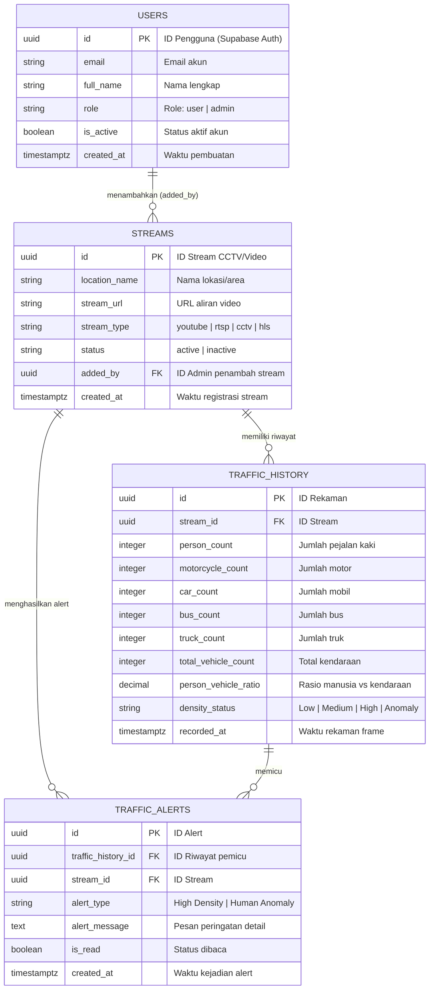

# Skema Database & Model Domain - Urban Density Monitor

Dokumen ini menjelaskan struktur data, skema database, dan model entitas domain yang digunakan dalam sistem **Urban Density Monitor** (Frontend Next.js dan integrasi Backend ML Vision & Supabase PostgreSQL).

---

## 1. Diagram Relasi Entitas (ERD)

Berikut adalah Entity-Relationship Diagram (ERD) yang menggambarkan hubungan antar tabel utama di dalam database:



---

## 2. Rincian Tabel Database (PostgreSQL / Supabase)

### 2.1 Tabel `streams`
Menyimpan informasi sumber aliran video (CCTV, RTSP, YouTube, dll.) yang dipantau secara *real-time* oleh model ML Vision.

| Nama Kolom | Tipe Data (SQL) | Tipe TypeScript | Keterangan | Aturan / Constraint |
|---|---|---|---|---|
| `id` | `uuid` | `string` | ID unik stream | Primary Key (Default: `uuid_generate_v4()`) |
| `location_name` | `varchar(255)` | `string` | Nama lokasi fisik CCTV (misal: "Simpang Lima, Semarang") | `NOT NULL` |
| `stream_url` | `text` | `string` | URL sumber video stream | `NOT NULL` |
| `stream_type` | `varchar(50)` | `"youtube" \| "rtsp" \| "cctv" \| "hls"` | Jenis protokol/layanan stream | `NOT NULL` |
| `status` | `varchar(20)` | `"active" \| "inactive"` | Status pemantauan stream | `DEFAULT 'active'` |
| `added_by` | `uuid` | `string \| null` | ID admin yang mendaftarkan stream | Foreign Key ke `users(id)`, `NULLABLE` |
| `created_at` | `timestamptz` | `string` | Waktu registrasi stream | `DEFAULT now()` |

---

### 2.2 Tabel `traffic_history`
Menyimpan data riwayat deteksi objek (manusia dan kendaraan) serta hasil analisis tingkat kepadatan dari proses *inference* ML secara berkala.

| Nama Kolom | Tipe Data (SQL) | Tipe TypeScript | Keterangan | Aturan / Constraint |
|---|---|---|---|---|
| `id` | `uuid` | `string` | ID unik rekam jejak | Primary Key |
| `stream_id` | `uuid` | `string` | ID stream CCTV asal analisis | Foreign Key ke `streams(id)`, `NOT NULL` |
| `person_count` | `integer` | `number` | Jumlah manusia / pejalan kaki terdeteksi | `DEFAULT 0` |
| `motorcycle_count` | `integer` | `number` | Jumlah sepeda motor terdeteksi | `DEFAULT 0` |
| `car_count` | `integer` | `number` | Jumlah mobil terdeteksi | `DEFAULT 0` |
| `bus_count` | `integer` | `number` | Jumlah bus terdeteksi | `DEFAULT 0` |
| `truck_count` | `integer` | `number` | Jumlah truk terdeteksi | `DEFAULT 0` |
| `total_vehicle_count` | `integer` | `number` | Total akumulasi kendaraan (`motor + car + bus + truck`) | `NOT NULL` |
| `person_vehicle_ratio` | `numeric(8, 4)` | `number` | Rasio perbandingan manusia terhadap kendaraan | `NOT NULL` |
| `density_status` | `varchar(50)` | `DensityStatus` | Kategori kepadatan hasil klasifikasi ML | `"Low Density" \| "Medium Density" \| "High Density" \| "Anomaly"` |
| `recorded_at` | `timestamptz` | `string` | Timestamp deteksi frame dilakukan | `DEFAULT now()`, `INDEXED` |

---

### 2.3 Tabel `traffic_alerts` (Peringatan Kepadatan & Anomali)
Menyimpan notifikasi serta peringatan darurat saat sistem mendeteksi lonjakan kepadatan atau kerumunan yang tidak wajar.

| Nama Kolom | Tipe Data (SQL) | Tipe TypeScript | Keterangan | Aturan / Constraint |
|---|---|---|---|---|
| `id` | `uuid` | `string` | ID unik alert | Primary Key |
| `traffic_history_id` | `uuid` | `string` | ID riwayat frame pemicu peringatan | Foreign Key ke `traffic_history(id)`, `NOT NULL` |
| `stream_id` | `uuid` | `string` | ID stream lokasi kejadian alert | Foreign Key ke `streams(id)`, `NOT NULL` |
| `alert_type` | `varchar(50)` | `AlertType` | Klasifikasi jenis alert | `"High Density" \| "Human Anomaly"` |
| `alert_message` | `text` | `string` | Deskripsi detail peringatan yang dapat dibaca manusia | `NOT NULL` |
| `is_read` | `boolean` | `boolean` | Status apakah notifikasi telah dibaca operator | `DEFAULT false` |
| `created_at` | `timestamptz` | `string` | Waktu peringatan dibuat | `DEFAULT now()`, `INDEXED` |

---

### 2.4 Tabel `users` (Pengguna & Hak Akses)
Menyimpan data akun pengguna serta operator yang dapat mengakses dan mengelola dasbor.

| Nama Kolom | Tipe Data (SQL) | Tipe TypeScript | Keterangan | Aturan / Constraint |
|---|---|---|---|---|
| `id` | `uuid` | `string` | ID pengguna | Primary Key (sinkron dengan `auth.users` Supabase) |
| `email` | `varchar(255)` | `string` | Alamat email pengguna | `UNIQUE`, `NOT NULL` |
| `full_name` | `varchar(255)` | `string` | Nama lengkap pengguna | `NOT NULL` |
| `role` | `varchar(20)` | `UserRole` | Peran/hak akses pengguna | `"user" \| "admin"`, `DEFAULT 'user'` |
| `is_active` | `boolean` | `boolean` | Status keaktifan akun | `DEFAULT true` |
| `created_at` | `timestamptz` | `string` | Waktu pendaftaran akun | `DEFAULT now()` |

---

## 3. Enumerasi (Enum) & Status Nilai

### 3.1 `DensityStatus` (Status Kepadatan)
Digunakan pada kolom `traffic_history.density_status` untuk merepresentasikan hasil klasterisasi kepadatan:
* `Low Density`: Keluaran lalu lintas lancar / jumlah objek rendah.
* `Medium Density`: Kepadatan normal / mulai ramai.
* `High Density`: Terdeteksi kemacetan atau penumpukan objek berlebih.
* `Anomaly`: Terjadi pola penyebaran atau kerumunan manusia yang abnormal (*Crowd Anomaly*).

### 3.2 `AlertType` (Kategori Peringatan)
Digunakan pada kolom `traffic_alerts.alert_type`:
* `High Density`: Dipicu oleh tingginya rasio kendaraan atau volume objek meledak melebihi ambang batas.
* `Human Anomaly`: Dipicu oleh deteksi pergerakan massa atau kerumunan yang berbahaya.

---

## 4. Model Domain di Frontend (`TrafficMetric.ts`)

Selain skema tabel database, aplikasi frontend menggunakan abstraksi interface TypeScript di `src/domain/entities/TrafficMetric.ts` untuk merepresentasikan komponen UI dasbor secara mandiri (*Clean Architecture*):

```typescript
// Kategori kartu metrik pada dasbor
export type MetricCategory = "vehicle" | "person" | "density" | "alert" | "anomaly";

// Status visualisasi metrik (menentukan indikator warna/badge)
export type MetricStatus = "normal" | "warning" | "critical" | "active";

// Model untuk kartu statistik individual (MetricCard)
export interface TrafficMetric {
  id: string;
  label: string;
  value: number | string;
  unit: string;
  iconName: string;
  category: MetricCategory;
  status: MetricStatus;
  colorAccent: string; // Kelas warna Tailwind atau Hex
  trend?: number;      // Persentase perubahan tren waktu ke waktu (opsional)
}

// Model untuk item daftar peringatan aktif pada AlertPanel
export interface AlertStatus {
  id: string;
  type: "emergency" | "anomaly" | "high_density" | "info";
  message: string;
  severity: "low" | "medium" | "high" | "critical";
  timestamp: string;
  isActive: boolean;
  locationZone?: string;
}

// Model gabungan untuk keseluruhan tampilan Dasbor Utama
export interface DashboardData {
  metrics: TrafficMetric[];
  alerts: AlertStatus[];
  lastUpdated: string;
  activeCamera: number;
  totalCameras: number;
  locationName: string;
  coordinates: { lat: number; lng: number };
}
```

---

## 5. Indeks Database yang Disarankan

Untuk mengoptimalkan performa pemuatan data *real-time* dan analitik riwayat (khususnya untuk halaman `/analytics` dan grafik rentang waktu), disarankan untuk menambahkan indeks pada PostgreSQL:

```sql
-- Indeks pencarian riwayat berdasarkan stream dan waktu rekaman (terbaru di atas)
CREATE INDEX IF NOT EXISTS idx_traffic_history_stream_recorded 
ON traffic_history (stream_id, recorded_at DESC);

-- Indeks filter status kepadatan pada analitik
CREATE INDEX IF NOT EXISTS idx_traffic_history_density_status 
ON traffic_history (density_status);

-- Indeks pencarian alert yang belum dibaca dan urutan waktu
CREATE INDEX IF NOT EXISTS idx_traffic_alerts_stream_created 
ON traffic_alerts (stream_id, created_at DESC) 
WHERE is_read = false;
```
